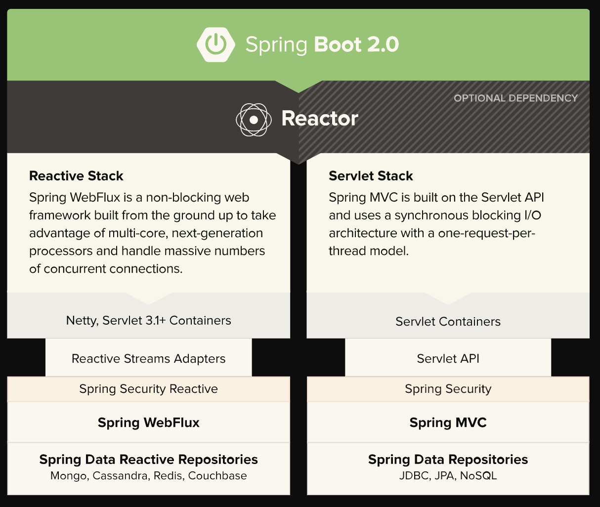

# 26. 웹 애플리케이션 개발

# 태그

---

#웹애플리케이션개발 #spring-boot-starter-web #tomcat #jetty #undertow 

# 질문

---

1. 스프링부트로 왜 개발해야 하는가?
2. 스프링부트로 어떻게 개발 하는가?

# 설명

---

# 아키텍처

---

## Spring MVC vs Spring Webflux

---

## Servlet vs Reactive

---

# Event Driven 흐름도

---

# Boot1 vs Boot2 성능 비교

---

# Response 흐름도

---

## Spring MVC

---

## WebFlux

---

# 특징

---

- 스프링부트는 웹 애플리케이션 배포에 최적화 되어 있다.
- 내장형 톰캣, 제티, 언더토우 등을 사용한 내장형 HTTP 서버를 만들 수 있다.(netty)
- spring-boot-starter-web 모듈 사용하여 웹 애플리케이션을 빠르게 구성 실행 가능

## hello world

---

@Controller, @RestContrller, @RequestMapping 사용하여 HTTP에 매핑

    @RestController
    @RequestMapping(value="/users")
    public class MyRestController {
    
        @RequestMapping(value="/{user}", method=RequestMethod.GET)
        public User getUser(@PathVariable Long user) {
            // ...
        }
    
        @RequestMapping(value="/{user}/customers", method=RequestMethod.GET)
        List<Customer> getUserCustomers(@PathVariable Long user) {
            // ...
        }
    
        @RequestMapping(value="/{user}", method=RequestMethod.DELETE)
        public User deleteUser(@PathVariable Long user) {
            // ...
        }
    
    }

### Spring MVC 자동설정

- `ContentNegotiatingViewResolver`와 `BeanNameViewResolver` 빈을 포함
- Webjars지원을 포함한 정적 자원 제공을 지원(추가내용 제공)
- `Converter, GenericConverter, Formatter` 빈을 자동등록
- `HttpMessageConverters` 지원(추가내용 제공)
- `MessageCodeResolver` 자동 등록(추가내용 제공)
- 정적 `index.html` 지원
- `favicon` 변경 지원

스프링 MVC 완벽히 제어하고 싶다면, @Configuration, @EnableMvc 사용할 수 있다.

추가적인 MVC 설정은 interceptor, formatters, viewController 

WebMvcConfigureAdapter 유형의 @Bean을 추가 할 수 있음.

### HttpMessageConverter

스프링 MVC는 Http 요청과 응답을 변환하는데  HttpMessageConverter 인터페이스를 사용한다. 

자동 Json(Jackson 라이브러리 사용), xml(jackson XML 확장, jaxb를 사용)

문자열 string은 UTF-8로 기본 인코딩 한다. 

    import org.springframework.boot.autoconfigure.web.HttpMessageConverters;
    import org.springframework.context.annotation.*;
    import org.springframework.http.converter.*;
    
    @Configuration
    public class MyConfiguration {
    
        @Bean
        public HttpMessageConverters customConverters() {
            HttpMessageConverter<?> additional = ...
            HttpMessageConverter<?> another = ...
            return new HttpMessageConverters(additional, another);
        }
    
    }

실무에서는...

    @Configuration
    public class MvcConfiguration implements WebMvcConfigurer {
    
        @Value(value = "${maxAgeSeconds:1000}")
        private static final long MAX_AGE_SECONDS = 3600;
    
        @Override
        public void addInterceptors(InterceptorRegistry registry) {
            registry.addInterceptor(new RequestProcessingTimeInterceptor())
                    .addPathPatterns("/smartplanner/*")		// 인터셉터 적용할 url
                    .excludePathPatterns("/login")	// 인터셉터 제외할 url
            ;
        }
    
        /**
         * core에서 설정함.
         * @return
         */
        @Bean
        public WebMvcConfigurer corsConfigurer() {
            return new WebMvcConfigurer() {
                @Override
                public void addCorsMappings(CorsRegistry registry) {
                    registry.addMapping("/**")
                            .allowedMethods("GET", "POST", "PUT", "DELETE")
                            .allowedOrigins("*")
                            .allowedHeaders("*")
                            .allowCredentials(true)
                            .maxAge(MAX_AGE_SECONDS);
                }
            };
        }
    
        @Bean(name = "asyncTask")
        public TaskExecutor asyncTask() {
    
            ThreadPoolTaskExecutor executor = new ThreadPoolTaskExecutor();
            executor.setThreadNamePrefix("asyncTask-");
            executor.setCorePoolSize(5);
            executor.setMaxPoolSize(100);
            executor.setQueueCapacity(0);
            executor.setRejectedExecutionHandler(new ThreadPoolExecutor.AbortPolicy());
            return executor;
        }
    
    }

    @Bean
    public LayoutDialect layoutDialect() {
    	return new LayoutDialect();
    }
    
    @Override
    public void configureViewResolvers(ViewResolverRegistry registry) {
    	ThymeleafViewResolver resolver = new ThymeleafViewResolver();
    	resolver.setTemplateEngine(templateEngine());
    	resolver.setCharacterEncoding("UTF-8"); // <- this was added
    	resolver.setForceContentType(true); // <- this was added
    	resolver.setContentType("text/html; charset=UTF-8"); // <- this was added
    	registry.viewResolver(resolver);
    }
    
    @Bean
    public SpringTemplateEngine templateEngine() {
    	SpringTemplateEngine templateEngine = new SpringTemplateEngine();
    	templateEngine.setTemplateResolver(templateResolver());	
    	templateEngine.setEnableSpringELCompiler(true);			// Spring EL 사용
    	templateEngine.addDialect(layoutDialect());
    	templateEngine.addDialect(new JSONMapperDialect());
    	return templateEngine;
    }
    
    @Bean
    public SpringResourceTemplateResolver templateResolver() {
    	SpringResourceTemplateResolver templateResolver = new SpringResourceTemplateResolver();
    	templateResolver.setCharacterEncoding("UTF-8"); // forcing UTF-8
    	templateResolver.setApplicationContext(applicationContext);	
    	templateResolver.setPrefix("classpath:/templates/");	// HTML 파일 위치 
    	templateResolver.setSuffix(".html");					// HTML 확장명 사용 
    	templateResolver.setTemplateMode(TemplateMode.HTML);	// HTML5 값은 비권장 됨
    	templateResolver.setCacheable(false);					// 캐시 사용 안함
    	return templateResolver;
    }
    
    @Override
    public void addResourceHandlers(ResourceHandlerRegistry registry) {
        registry.addResourceHandler("/static/**")			// 리소스와 매칭될 url
        	.addResourceLocations("classpath:/static/");		// 리소스 위치
        	// .setCachePeriod(60);							// 캐시 지속 시간
            //.setCacheControl(CacheControl.maxAge(7, TimeUnit.DAYS).cachePublic());
        
        registry.addResourceHandler("/webjars/**")
        .addResourceLocations("/webjars/");
    }

MessageCodesResolver(오류 메시지에 대한 코드 처리)

[Validator / Error interface .... in Spring](https://ezsnote.tistory.com/entry/Validator-Error-interface-in-Spring)

### MessageCodesResolver 가기전 선행해야 하는것들

Errors 와 BindingResult 인터페이스의 사용처를 보면,

- Errors : 유효성 검증 결과를 저장할때 사용

    값이 올바르지 않을경우 reject() 또는 rejectValue()메소드를 이용해서 어떤 필드가 잘못되었는지, 관련된 에러가 무엇인지 입력받는다.

    **reject():** 메소드는 검증 대상 객체의 전체적인 에러를 설정. (이게 글로벌..을 의미함)

    **rejectValue():** 메소드는 특정 프로퍼티의 검증에러를 설정한다.

- BindingResult : Errors 인터페이스의 하위 인터페이스로 폼 값을 커맨드객체에 바인딩한 결과로 저장함.

        @RequestMapping(method = RequestMethod.POST)
        public String submit(@Valid LoginCommand loginCommand, 
        			BindingResult result) {
        		if (result.hasErrors()) {
        			return formViewName;
        		}
        		try {
        			authenticator.authenticate(loginCommand);
        			return "redirect:/index.jsp";
        		} catch (AuthenticationException e) {
        // 이 경우의 익셉션은 로그인 실패이지 값이 없거나 하는게 아니다. 즉 깂이 잘못된(아이디나 패스워드가 잘못된) 객체의 문제이다.
        //  그러면 아래체럼... reject를 이용해 글로벌에러정보(전체적인 에러정보) 를 추가할 수 있다 
        			result.reject("invalidIdOrPassword", new Object[] { loginCommand.getUserId() }, null);
        			return formViewName;
        		}
        }
        
        // rejectValue 를 이용하면 객체의 개별 프로퍼티(필드)에 대한 에러정보를 추가할 수 있다.
        @Override
        public void validate(Object target, Errors errors) {
        		MemberInfo memberInfo = (MemberInfo) target;
        		if (memberInfo.getId() == null || memberInfo.getId().trim().isEmpty()) {
        			errors.rejectValue("id", "required");
        		}
        		if (memberInfo.getName() == null
        				|| memberInfo.getName().trim().isEmpty()) {
        			errors.rejectValue("name", "required");
        		}
                ....
        }

BindingResult 인터페이스의 기본 구현클래스(AbstractBindingResult) 클래스는 MessageCodesResolver를 사용하여 에러코드에 대한 에러메시지를 추출한다. 기본적으로 DefaultMessageCodeResolver클래스를 MessageCodesResolver로 사용한다네..DefaultMessageCodeResolver 를 이용해서 자동으로 에러메시지를 생성하려면 MessageSource를 빈 객체로 등록해야한단다.

에러메시지를 출력할 때에는 스프링이 제공하는 <form:errors> 커스텀 태그를 사용하면된다.뷰로 jsp를 사용할 경우 2가지 방식으로 에러메시지를 설정한다.ㄱ. <spring:hashBindErrors> 커스텀 태그를 이용하여 에러정보를 설정

스프링 MVC는 MessageCodesResolver에 선언된 에러로부터 에러메시지를 표시하기 위해 에러코드를 생성하는 전략을 가지고 있다. 

spring.mvc.message-codes-resolver.format를 설정하여 PREFIX_ERROR_CODE

[SpringBoot application.properties 설정가능한 것들 모음~🎵](https://culinarydeveloper.tistory.com/24)

['분류 전체보기' 카테고리의 글 목록](https://nuninaya.tistory.com/category)

    # SPRING MVC (HttpMapperProperties)
    http.mappers.json-pretty-print=false # pretty print JSON
    http.mappers.json-sort-keys=false # sort keys
    spring.mvc.locale= # set fixed locale, e.g. en_UK
    spring.mvc.date-format= # set fixed date format, e.g. dd/MM/yyyy
    spring.mvc.message-codes-resolver-format= # PREFIX_ERROR_CODE / POSTFIX_ERROR_CODE
    spring.view.prefix= # MVC view prefix
    spring.view.suffix= # ... and suffix
    spring.resources.cache-period= # cache timeouts in headers sent to browser
    spring.resources.add-mappings=true # if default mappings should be added

기본: DefaultMessageCodesResolver

    @Bean
    public LocalValidatorFactoryBean validator(MessageSource messageSource) {
      LocalValidatorFactoryBean bean = new LocalValidatorFactoryBean();
      bean.setValidationMessageSource(messageSource);
      return bean;
    }
    
    ---
    "code": "NotNull",
    "codes": [
       "NotNull.user.firstName",
       "NotNull.firstName",
       "NotNull.java.lang.String",
       "NotNull"
    ],
    
    ---
    @Autowired
    private MessageSource messageSource;
    
    @PostMapping("/users")
    public List<ObjectError> testValidation(@Valid @RequestBody User user, BindingResult bindingResult){
       bindingResult.getFieldErrors().forEach(fieldError -> new ObjectError(
       /*Assumes that ObjectError has constructor of ObjectError(String message) */
              messageSource.getMessage(fieldError, Locale.getDefault())
       ));
       return null; 
    }

messages.properties :

    NotNull.user.firstName=This doesn't work
    NotNull.firstName=Or this
    NotNull.java.lang.String=This doesn't work either
    NotNull=And this doesn't work
    
    javax.validation.constraints.NotNull.message=THIS DOES WORK! But why have codes then?

### 정적 컨텐츠 Static Content

스프링부트는 기본적으로 클래스패스 혹은 ServletContext 루트에 있는 /static(혹은 /public 혹은 /resource 혹은 /META-INF/resource) 기반으로 정적 컨텐츠를 제공한다. 스프링MVC의 ResourceHttpRequestHandler를 사용하거나 WebMvcConfigureAdapter를 추가하고 addResourceHandler 메서드를 오버라이드하여 수정할 수 있다.

앞에서 살펴본 기본 정적 자원 위치 외에, Webjars content 를 사용하는 특이한 경우가 있다. Webjar 형태로 묶인 jar 파일 안에 있는 /webjars/** 경로에 있는 자원들이 제공된다.

팁: 애플리케이션을 jar 로 묶으려packaged 한다면 src/main/webapp 폴더는 사용하지 말자. 이 폴더는 일반적으로, 'war' 묶음인 경우에만 동작하며, 대부분의 빌드툴이 jar 파일을 생성하는 과정에서 암묵적으로 무시한다.

### Template engines

REST 웹서비스가 잘 되어 있다면, 스프링MVC를 이용하여 동적인 HTML 컨텐츠를 제공할 수 있다. 스프링MVC는 벨로시티Velocity, 프리마커FreeMarker 그리고 JSP 등을 포함한 다양한 템플릿 기술을 지원한다. 다양한 템플릿 엔진들을 스프링MVC와의 통합된다.

스프링부트는 다음의 템플릿 엔진들을 지원하는 자동설정을 포함하고 있다:

- [프리마커FreeMarker](http://freemarker.org/docs/)
- [그루비Groovy](http://beta.groovy-lang.org/docs/groovy-2.3.0/html/documentation/markup-template-engine.html)
- [타임리프Thymeleaf](http://www.thymeleaf.org/)
- [벨로시티Velocity](http://velocity.apache.org/)

위에 거론된 템플릿 엔진들 중에서 한가지를 기본설정으로 사용하며느, 템플릿들은 src/main/resources/template 에서 자동으로 가져온다.

팁: JSPs는 가능하면, 내장형 서블릿 컨테이너를 사용할 때 알려진 여러가지 제약사항들을 피하길 바란다.

### 오류제어 Error handling

스프링부트는 /error 와 매칭되는 다양한 경로의 모든 에러 서블릿 컨테이너에 등록된 'global' 에러 페이지를 제어한다. 클라이언트는 HTTP 상태와 예외 메시지 등의 에러에 관한 자세한 내용을 JSON 응답으로 제공받을 수 있다. 브라우저인 경우에는 HTML 형태에 동일한 데이터를 기록한 Whitelabel!(변경하는 방법 하려면 'error'를 처리하는 view를 추가하면 된다) 에러 뷰를 보게된다. 기본적으로는 ErrorController를 구현하고 빈으로 정의하면 완벽히 대처가 가능하다. 혹은 이미 존재하는 코드에 따라 ErrorAttributes 빈을 간단히 추가할 수 있지만 내용을 대체해야 한다.

    @Bean
    public EmbeddedServletContainerCustomizer containerCustomizer(){
        return new MyCustomizer();
    }
    
    // ...
    
    private static class MyCustomizer implements EmbeddedServletContainerCustomizer {
    
        @Override
        public void customize(ConfigurableEmbeddedServletContainer container) {
            container.addErrorPages(new ErrorPage(HttpStatus.BAD_REQUEST, "/400"));
        }
    
    }

또한 @ExceptionHandler method 그리고 @ControllerAdvice 같은 일반적인 스프링MVC의 기능들을 사용할 수 있다. ErrorController 제어되지 않는 예외들을 다룰 때 사용한다.

Filter를 통해 ErrorPage 경로를 등록하여 제어할 수도 있다(예로, Jersey 그리고 Wicket 과 같은 비 스프링웹프레임워크에서는 일반적으로 사용), Filter는 ERROR 디스패쳐dispatcher에 등록된다. 예:

    // 참고: https://naning9.tistory.com/12
    // 기본적으로 Spring boot에서는 에러를 처리하는 filter가 자동으로 동작한다.
    ERROR [] --- ErrorPageFilter : Cannot forward to error page for request [/] as the response has already been committed. As a result, the 
    
    response may have the wrong status code. If your application is running on WebSphere Application Server
    
    you may be able to resolve this problem by setting com.ibm.ws.webcontainer.invokeFlushAfterService to false
    
    ---
    @Bean     
    public ErrorPageFilter errorPageFilter() {    
          return new ErrorPageFilter();    
    }  
    
    @Bean 
    public FilterRegistrationBean DisabledErrorPageFilter(ErrorPageFilter filter) { 
          FilterRegistrationBean filterRegistration = new FilterRegistrationBean<>(); 
          filterRegistration.setFilter(filter); 
          filterRegistration.setName("disabledErrorPageFilter"); 
          filterRegistration.setEnabled(false); 
          return filterRegistration; 
    }
    
    ---
    The bean 'ErrorPageFilter', defined in class path resource [ErrorPageRegistry.class], could not be registered. A bean with that name has already been defined in class path resource [ErrorPageFilter.class] and overriding is disabled.
    
    ---
    spring:
       main: 
         allow-bean-definition-overriding: true

기본적으로 FilterRegisterBean는 ERROR dispatcher 타입에 포함되지 않는다

### JAX-RS 그리고 Jersey

EST 엔드포인트르 위해서 JAX-RS 프로그래밍 모델을 참조하여 스프링MVC를 대체할 구현체를 찾고 있다면, 애플리케이션 컨텍스트에 등록되는 @Bean 처럼 Servlet과 Filter를 등록하면 Jersy 1.x 와 Apache Celtix에서도 잘 동작할 것이다. Jersey 2.x 는 스프링을 지원하기에 스프링부트 스타터에 자동설정을 제공하고 있다.

Jersey 2.x 을 시작할 때 spring-boot-starter-jersey 스타터에 대한 의존성을 추가하고 ResourceConfig 형태의 @Bean이 하나 필요하며 여기에 모든 엔드포인트를 등록하면 된다:

    @Component
    public class JerseyConfig extends ResourceConfig {
        public JerseyConfig() {
            register(Endpoint.class);
        }
    }

등록된 모든 엔드포인트에는 HTTP 자원 애노테이션 종류인 @Component(예: @GET) 가 선언되어야 한다.

    @Component
    @Path("/hello")
    public class Endpoint {
    
        @GET
        public String message() {
            return "Hello";
        }
    
    }

### 내장형 서블릿 컨테이너 지원

스프링부트는 내장형 톰캣Tomcat, 제티Jetty, 그리고 언더토우Undertow 서버를 지원한다. 대부분의 개발자들은 '스타터Starter POM'을 포함시키는 것으로 모든 설정이 되어 있어 쉽게 사용할 수 있다. 내장된 서버의 기본 HTTP Request 접근포트는 8080 이다.

서블릿 그리고 필터

내장형 서블릿 컨테이너를 사용할 때 스프링빈으로 서블릿과 필터를 등록할 수 있다.

ServletRegistrationBean, FilterRegsitrationBean, ServletContextInitializer

EmbeddedWebApplicationContext

스프링부트는 내장형 서블릿 컨테이너를 지원하기 위해 ApplicationContext의 새로운 형태를 사용한다.

내장형 서블릿 컨테이너 변경

- `server.port` - HTTP 요청 수용 포트
- `server.address` - 연결된 인터페이스 주소
- `server.sessionTimeout` - 세션 타임아웃

프로그래밍으로 변경하기

    import org.springframework.boot.context.embedded.*;
    import org.springframework.stereotype.Component;
    
    @Component
    public class CustomizationBean implements EmbeddedServletContainerCustomizer {
    
        @Override
        public void customize(ConfigurableEmbeddedServletContainer container) {
            container.setPort(9000);
        }
    
    }

ConfigurableEmbeddedServletContainer 직접 변경

TomcatEmbeddedServletContainerFactory, 

JettyEmbeddedServletContainerFactory, 

UndertowEmbeddedServletContainerFactory

    @Bean
    public EmbeddedServletContainerFactory servletContainer() {
        TomcatEmbeddedServletContainerFactory factory = new TomcatEmbeddedServletContainerFactory();
        factory.setPort(9000);
        factory.setSessionTimeout(10, TimeUnit.MINUTES);
        factory.addErrorPages(new ErrorPage(HttpStatus.404, "/notfound.html");
        return factory;
    }

JSP 제약사항 

스프링부트를 실행할 때 내장 서블릿 컨테이너를 사용한다면(실행가능한 압축패키지라면), JSP 지원이 제약되는 경우가 있다.

- 톰캣에서 'war' 패키징을 사용한다면, 실행가능한 war로 동작한다면, 표준 컨테이너에 배포한다면 별다른 문제는 없을 것이다(제한은 없다, 톰캣을 포함해서). 실행가능한 jar 는 톰캣에서 하드코드 파일패턴 때문에 동작하지 않는다.
- 제티는 내장 컨테이너에서 JSP를 지원하지 않는다.
- 언더토우는 JSP를 지원하지 않는다.